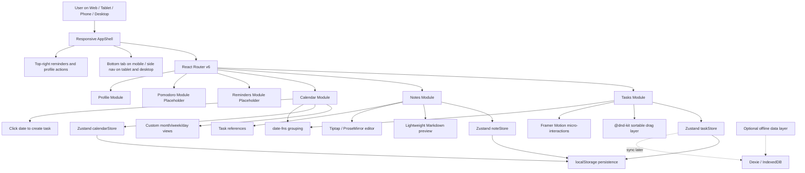

# myschedule Architecture

myschedule is a multi-device schedule manager for tasks, notes, calendar, reminders, pomodoro, countdowns, and integrations.

## Project Structure

```text
web-app/
├── docs/
│   └── architecture.md
├── public/
├── src/
│   ├── app/
│   │   └── App.tsx
│   ├── components/
│   │   ├── command/
│   │   │   └── CommandPalette.tsx
│   │   ├── layout/
│   │   │   ├── AppShell.tsx
│   │   │   └── ModulePlaceholder.tsx
│   │   ├── navigation/
│   │   │   ├── BottomTabBar.tsx
│   │   │   └── SideNav.tsx
│   │   └── ui/
│   │       ├── BottomSheet.tsx
│   │       ├── EmptyState.tsx
│   │       ├── ErrorBanner.tsx
│   │       ├── OfflineBanner.tsx
│   │       ├── SkeletonLoader.tsx
│   │       └── ToastProvider.tsx
│   ├── features/
│   │   ├── calendar/
│   │   │   ├── components/
│   │   │   │   └── CalendarPage.tsx
│   │   │   └── store/
│   │   │       └── calendarStore.ts
│   │   ├── profile/
│   │   │   └── components/
│   │   │       └── ProfilePage.tsx
│   │   ├── notes/
│   │   │   ├── components/
│   │   │   │   ├── NoteEditor.tsx
│   │   │   │   └── NotesPage.tsx
│   │   │   ├── store/
│   │   │   │   └── noteStore.ts
│   │   │   ├── types.ts
│   │   │   └── utils.tsx
│   │   └── tasks/
│   │       ├── components/
│   │       │   ├── BulkActionBar.tsx
│   │       │   ├── EmptyTaskState.tsx
│   │       │   ├── PriorityBadge.tsx
│   │       │   ├── SortableTaskCard.tsx
│   │       │   ├── TaskEditor.tsx
│   │       │   ├── TaskGroup.tsx
│   │       │   └── TaskListPage.tsx
│   │       ├── store/
│   │       │   └── taskStore.ts
│   │       ├── types.ts
│   │       └── utils.ts
│   ├── lib/
│   │   ├── cn.ts
│   │   └── ids.ts
│   ├── styles/
│   │   └── index.css
│   ├── main.tsx
│   └── vite-env.d.ts
├── index.html
├── package.json
├── tailwind.config.js
├── postcss.config.js
└── tsconfig.json
```

## Technical Architecture



## Implementation Notes

- Mobile first: bottom tab bar under `640px`.
- Tablet: persistent side navigation from `sm` upward.
- Desktop: side navigation plus right detail/insight panel from `lg` upward.
- Tasks are persisted with Zustand `persist` middleware.
- Notes are persisted with Zustand `persist` middleware.
- Calendar view state is persisted with Zustand `persist` middleware.
- Local persistence keeps the legacy `focusflow.*` keys for migration compatibility while the product is branded as myschedule.
- Ephemeral UI state such as selected task checkboxes is intentionally not persisted.
- Drag ordering is stored as an `order` number on each task.
- Keyboard shortcuts currently implemented: `N` opens the task editor and `Cmd/Ctrl + K` opens the command palette.
- Calendar supports month/week/day views, today highlight, optional lunar labels, and click-to-create tasks.
- Notes support Tiptap rich-text editing, Markdown shortcuts, floating selection toolbar, slash commands, tags, debounced full-text search, pinned cards, version history, and task references.
- Reminders are exposed as a top-right utility action instead of a primary navigation tab.
- Profile shows local data counts and storage keys.
